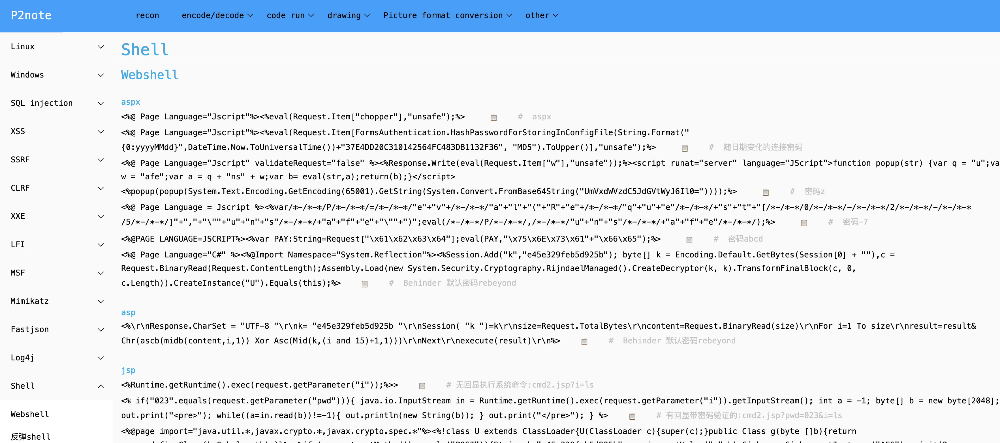

<h1>P2note</h1>

    

## 一、声明

​		本工具仅面向合法授权的企业安全建设行为，请勿对非授权目标进行测试。如果您在使用本工具的过程中存在任何非法行为，您需自行承担相应后果，作者将不承担任何法律及连带责任。

## 二、简介

​		P2note(Penetration-test payload note) 是基于layui 框架设计的一款渗透测试懒人工具，本意为**减少渗透测试人员记忆payload的数量，提升渗透测试效率**。

## 三、增删改查

### 3.1 Plan A

为了**方便增删改查** data-note.json文件，扣了一个add_gui，在PlanA文件夹下，源码就不发出来献丑了，各位凑合用。

**tips:**

- 新增标题：删掉原来的直接加就行，标题不支持修改
- 注释符：由于#号可能会被用到，所以匹配 三个箭头把注释与内容分割（→→→）

### 3.2 Plan B

使用大佬的json解析工具，已经魔改好了，放在PlanB文件夹下。

repo:https://github.com/josdejong/jsoneditor

